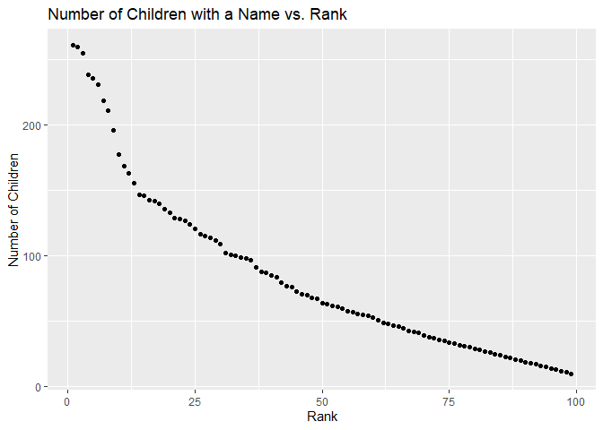

p8105\_HW2\_rat2134
================
Robert Tumasian
9/28/2019

``` r
#Load required packages
library(readxl)
library(janitor)
library(tidyverse)
library(dplyr)
library(tibble)
library(knitr)
```

# Problem 1

``` r
#Import Mr. Trash Wheel dataset 
Mr_Trash_Data = 
  read_excel("./HW2_datasets/Mr_Trash_Wheel.xlsx",
             range = cell_cols("A:N")) %>%
  drop_na() %>%
  janitor::clean_names() %>%
  mutate(sports_balls = as.integer(
    round(sports_balls, 
          digits = 0)))
```

``` r
#Import and clean precipitation data for 2017 and 2018
Precipitation_data_2017 =
  read_excel("./HW2_datasets/Mr_Trash_Wheel.xlsx",
             sheet = 6,
             cell_rows(3:14),
             col_names = c("Month", "Total_Precipitation")) %>%
  mutate(Year = 2017)

Precipitation_data_2018 =
  read_excel("./HW2_datasets/Mr_Trash_Wheel.xlsx",
             sheet = 5,
             cell_rows(3:14),
             col_names = c("Month", "Total_Precipitation")) %>%
  mutate(Year = 2018)

#Combine data sets
Precipitation_data_2017_and_2018 = 
  bind_rows(Precipitation_data_2017, Precipitation_data_2018) %>%
  mutate(Month = month.name[Month]) %>%
  select(Year, Month, Total_Precipitation, everything())
```

`Mr_Trash_Data` has 344 observations and 14 variables:

  - Dumpster number (`dumpster`, numeric vector)
  - Month (`month`, character vector)
  - Year (`year`, numeric vector)
  - Date of dumpster check (`date`, POSIXct format of form YYYY-MM-DD,
    used to store dates)
  - Weight (in tons) of trash in dumpster (`weight_tons`, numeric
    vector)
  - Volume (in cubic yards) of trash in dumpster (`volume_cubic_yards`,
    numeric vector)
  - Number of plastic bottles found in dumpster (`plastic_bottles`,
    numeric vector)
  - Number of polystyrenes found in dumpster (`polystyrene`, numeric
    vector)
  - Number of cigarette butts found in dumpster (`cigarette_butts`,
    numeric vector)
  - Number of glass bottles found in dumpster (`glass_bottles`, numeric
    vector)
  - Number of grocery bags found in dumpster (`grocery_bags`, numeric
    vector)
  - Number of chip bags found in dumpster (`chip_bags`, numeric vector)
  - Number of sports balls found in dumpster (`sports_balls`, integer
    vector)
  - Number of homes powered (`homes_powered`, numeric vector, *each ton
    of trash equates to on average 500 kilowatts of electricity and an
    average household will use 30 kilowatts per day*)

`Precipitation_data_2017_and_2018` has 24 observations and 3 variables:

  - Year (`Year`, numeric vector)
  - Month (`Month`, character vector)
  - Total Precipitation in inches (`Total_Precipitation`, numeric
    vector)

With the data available, the total precipitation in 2018 was 70.33
inches. In addition, the median number of sports balls found in the
dumpsters in 2017 was 8.

# Problem 2

``` r
#Import and clean pols-month dataset
Pols_month = 
  read_csv("./HW2_datasets/fivethirtyeight_datasets/pols-month.csv") %>%
  separate(mon, into = c("year", "month", "day")) %>%
  mutate(month = month.name[as.factor(month)]) %>%
  #In addition to 0s and 1s in the prez_gop variable, there are also 2s
  #All 2s will be reassigned to 1s
  mutate(prez_gop = ifelse(prez_gop == 1 | prez_gop == 2, 1, 0)) %>%
  mutate(president = recode(prez_gop, `0` = "dem", `1` = "gop")) %>%
  select(-c(prez_dem, prez_gop, day))
```

``` r
#Import and clean snp dataset
snp =
  read_csv("./HW2_datasets/fivethirtyeight_datasets/snp.csv") %>%
  separate(date, into = c("month", "day", "year")) %>%
  arrange(year, month) %>%
  select(-day) %>%
  mutate(month = month.name[as.factor(month)]) %>%
  select(year, month, everything())
```

``` r
#Import and clean unemployment dataset
unemployment_data = 
  read_csv("./HW2_datasets/fivethirtyeight_datasets/unemployment.csv") %>%
  pivot_longer(
    Jan:Dec,
    names_to = "month",
    values_to = "unemployment_percentage"
  ) %>%
  rename(year = Year) %>%
  arrange(year, month) %>%
  mutate(month = month.name[as.factor(month)]) %>%
  mutate(year = str_c(year))
```

``` r
#Merging all three datasets
snp_and_pols = left_join(Pols_month, snp, by = c("year", "month"))

snp_and_pols_and_unemployment = left_join(snp_and_pols, 
                                          unemployment_data, 
                                          by = c("year", "month"))
```

The `Pols_month` dataset contains 822 observations and 9 variables:

  - Year (`year`, character vector)
  - Month (`month`, character vector)
  - Number of republican governors (`gov_gop`, numeric vector)
  - Number of republican senators (`sen_gop`, numeric vector)
  - Number of republican representatives (`rep_gop`, numeric vector)
  - Number of democratic governors (`gov_dem`, numeric vector)
  - Number of democratic senators (`sen_dem`, numeric vector)
  - Number of democratic representatives (`rep_dem`, numeric vector)
  - The political party of the serving President (`president`, character
    vector)

This data is available from January 1947 to June 2015.

The `snp` dataset contains 787 observations and 3 variables:

  - Year (`year`, character vector)
  - Month (`month`, character vector)
  - The closing value of the S\&P stock index on the associated date
    (`close`, numeric vector)

This data is available from January 1950 to October 2015.

The `unemployment_data` dataset contains 816 observations and 3
variables:

  - Year (`year`, character vector)
  - Month (`month`, character vector)
  - Percentage of unemployment (`unemployment_percentage`, numeric
    vector)

This data is available from January 1948 to September 2015.

Lastly, the `snp_and_pols_and_unemployment` dataset (merged by year and
month) contains 822 observations and 11 variables. All the variables in
this combined dataset contain those in the `Pols_month`, `snp`, and
`unemployment_data` datasets. This data is available in different time
intervals for different variables, which explains why there are some
`NA` values.

# Problem 3

``` r
#Import and clean baby names data
popular_baby_names = 
  read_csv("./HW2_datasets/Popular_Baby_Names.csv") %>%
  janitor::clean_names() %>%
  mutate(ethnicity = replace(ethnicity, 
                             ethnicity == "ASIAN AND PACI", 
                             "ASIAN AND PACIFIC ISLANDER"),
         ethnicity = replace(ethnicity, 
                             ethnicity == "WHITE NON HISP", 
                             "WHITE NON HISPANIC"),
         ethnicity = replace(ethnicity, 
                             ethnicity == "BLACK NON HISP", 
                             "BLACK NON HISPANIC")) %>%
  mutate(ethnicity = str_to_lower(ethnicity),
         childs_first_name = str_to_lower(childs_first_name),
         gender = str_to_lower(gender)) %>%
  distinct()
```

``` r
#Table showing rank in popularity of "Olivia" from 2011 to 2016
Olivia_rank_table = 
  filter(popular_baby_names, childs_first_name == "olivia") %>%
  select(year_of_birth, ethnicity, rank) %>%
  pivot_wider(
    names_from = year_of_birth,
    values_from = rank) %>%
  rename("Ethnicity" = ethnicity)

kable(Olivia_rank_table)
```

| Ethnicity                  | 2016 | 2015 | 2014 | 2013 | 2012 | 2011 |
| :------------------------- | ---: | ---: | ---: | ---: | ---: | ---: |
| asian and pacific islander |    1 |    1 |    1 |    3 |    3 |    4 |
| black non hispanic         |    8 |    4 |    8 |    6 |    8 |   10 |
| hispanic                   |   13 |   16 |   16 |   22 |   22 |   18 |
| white non hispanic         |    1 |    1 |    1 |    1 |    4 |    2 |

``` r
#Table showing most popular male baby name over time
Most_popular_male_baby_name = 
  filter(popular_baby_names, gender == "male" & rank == 1) %>%
  select(-c(gender, count, rank)) %>%
  pivot_wider(
    names_from = year_of_birth,
    values_from = childs_first_name) %>%
  rename(Ethnicity = ethnicity)

kable(Most_popular_male_baby_name)
```

| Ethnicity                  | 2016   | 2015   | 2014   | 2013   | 2012   | 2011    |
| :------------------------- | :----- | :----- | :----- | :----- | :----- | :------ |
| asian and pacific islander | ethan  | jayden | jayden | jayden | ryan   | ethan   |
| black non hispanic         | noah   | noah   | ethan  | ethan  | jayden | jayden  |
| hispanic                   | liam   | liam   | liam   | jayden | jayden | jayden  |
| white non hispanic         | joseph | david  | joseph | david  | joseph | michael |

``` r
#Obtain data for all male, white non-hispanic baby names in 2016
Male_White_Non_Hispanic_Names_2016 = 
  filter(popular_baby_names, gender == "male" & 
           ethnicity == "white non hispanic" &
           year_of_birth == 2016)

#Create scatterplot of number of children vs. rank
children_vs_rank_plot = 
  ggplot(Male_White_Non_Hispanic_Names_2016, 
         aes(x = rank, y = count)) +
  geom_point() +
  xlab("Rank") +
  ylab("Number of Children") +
  ggtitle("Number of Children with a Name vs. Rank")

plot(children_vs_rank_plot)
```

<!-- -->
